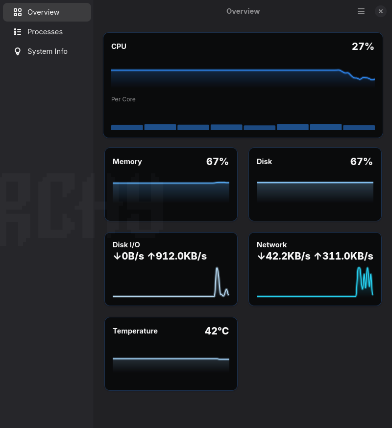
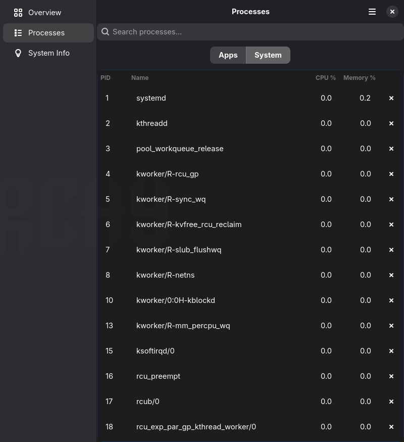
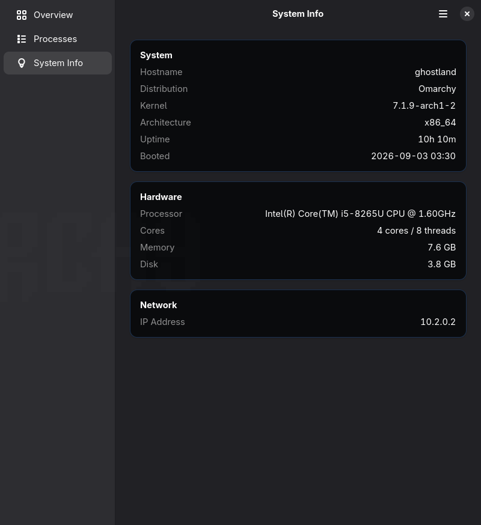
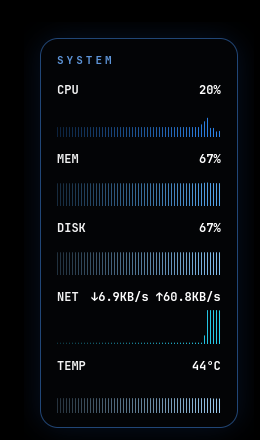

# Resmon

A clean system resource monitor for the desktop, in two forms sharing the
same metrics code:

- **The app** — a sidebar-navigated window: an Overview (CPU hero card with
  per-core detail, plus a responsive tile grid for memory, disk, disk I/O,
  network, GPU, temperature — each a smooth gradient trend graph), a
  Processes tab (searchable, tree-structured), and a System Info page.
- **The overlay** — a small borderless widget docked to a screen corner,
  always on top, never stealing keyboard focus.

Built with GTK4 + libadwaita and `gtk4-layer-shell`. Developed on
[Omarchy](https://omarchy.org) (Arch + Hyprland) — see
[Compatibility](#compatibility) for what that means elsewhere.

|                                |                                |
| ------------------------------ | ------------------------------ |
|  |  |
|  |  |

## Requirements

This is Linux-only, Wayland-first, and currently assumes a wlroots
compositor (Hyprland) for the overlay and the Apps/System process split —
see [Compatibility](#compatibility). You'll need, via your system package
manager (these are **not** pip-installable):

- Python ≥ 3.11, GTK4, libadwaita ≥ 1.9, PyGObject, `gtk4-layer-shell`
- [`psutil`](https://pypi.org/project/psutil/) — pip-installable, or your
  distro's package

```
# Arch / Omarchy
sudo pacman -S python-gobject python-psutil gtk4 libadwaita gtk4-layer-shell

# Fedora
sudo dnf install python3-gobject python3-psutil gtk4 libadwaita gtk4-layer-shell

# Debian / Ubuntu (gtk4-layer-shell may need a PPA or building from source —
# it's not always packaged; the overlay falls back to a plain window without it)
sudo apt install python3-gi python3-psutil gir1.2-gtk-4.0 gir1.2-adw-1
```

## Install (adds it to your app launcher)

```
git clone https://github.com/TheRealGhost007/resmon.git
cd resmon
./bin/install-app
```

Adds a `resmon` command to `~/.local/bin`, plus two entries to your app
launcher: **Resource Monitor** (the app) and **Resource Monitor Overlay**
(the widget) — so either can be launched without a terminal. Both keep
pointing back at this checkout; `git pull` to update, no need to reinstall.

## Run

```
resmon              # the full app
resmon --overlay    # just the overlay widget
```

Before installing, use `./bin/resmon` / `./bin/resmon --overlay` the same way.

The overlay anchors as a layer-shell surface on Wayland compositors with
`wlr-layer-shell` (e.g. Hyprland). `--overlay --windowed` runs it as a plain
floating window instead — useful under X11, nested sessions, or to test
without a compositor.

## Settings

Open **Preferences** from the app's menu (or `Ctrl+,`) to:

- Choose a **Theme**: Default (multi-color) or Onyx (high-contrast,
  near-black with every metric in a shade of blue)
- Choose an **Update Interval**: 1s/2s/5s — lower is more responsive, higher
  uses less CPU. Defaults to 2s.
- Choose an overlay **Style**: Bars (scrolling history graphs) or
  Percentages (a compact stat card — just the numbers, no graphs)
- Show/hide the overlay for the current session
- Start the overlay automatically at login (writes a standard XDG autostart
  entry — no compositor-specific config needed)
- Choose which screen corner it docks to
- **Alerts**: a desktop notification when CPU/memory/temperature crosses a
  threshold you set (0 disables that metric) — checked wherever the app or
  overlay is running, at most once every 5 minutes per metric so a sustained
  high reading doesn't spam you

Theme applies live to the app; other overlay settings restart the overlay
(if running) to apply. Settings persist to `~/.config/resmon/settings.json`.

## Staying lightweight

- The **Update Interval** setting (above) is the main lever — it governs
  every psutil/proc read and Cairo redraw.
- GPU polling (a subprocess spawn for NVIDIA) and temperature sensor reads
  are inherently pricier than the rest, so they're only actually re-queried
  every 5th tick regardless of interval — the graph still gets a fresh point
  every tick, just repeating the last known value in between.
- The Processes tab's full process scan only ever runs while that tab is
  actually visible — switching to Overview (or just leaving the app on it)
  stops it entirely rather than scanning in the background.

## GPU + temperature

Shown automatically when available, hidden otherwise — no setting needed:

- **Temperature**: via `psutil.sensors_temperatures()` (coretemp, k10temp,
  cpu_thermal, acpitz, ...). Works on most Linux CPUs.
- **GPU**: NVIDIA via `nvidia-smi` if installed, AMD via the amdgpu sysfs
  files (`gpu_busy_percent`, `mem_info_vram_*`). Intel iGPUs don't expose a
  usage percentage without elevated perf-event permissions, so they're
  currently treated as unavailable and the row stays hidden.

## Processes tab

Splits into **Apps** and **System**:

- **Apps**: an app's *entire* process tree, not just the window-owning PID —
  a browser's renderer/GPU helper subprocesses land here too, collapsed
  under the window title by default, with a disclosure arrow to expand and
  see them individually. The collapsed row shows *aggregate* CPU/memory
  across the whole subtree (a browser's own main process is often nearly
  idle while its renderers do the real work, so the individual figure alone
  would be misleading).
- **System**: the complement — everything not part of an app's tree (kernel
  threads, systemd, drivers, background services). Flat, no tree.

Classification walks each process's parent chain (via `ppid`) up to see if
it's a descendant of a window-owning PID (from `hyprctl clients`); root PIDs
come from Hyprland specifically, so this tab is Hyprland-only for now (falls
back to an empty Apps list gracefully elsewhere, same as before). Every row
has an end-process button that confirms before sending `SIGTERM`. Expanded
branches reset to collapsed on each refresh (same simple rebuild-the-list
approach as everything else here) — a known rough edge, not by design.

A search box above the toggle filters both tables by name as you type (live,
not waiting for the next periodic refresh); for Apps, an app's whole subtree
stays visible if *either* the app itself or any of its descendants match.

## System Info

A static-info reference page: hostname, distro, kernel, architecture,
uptime, boot time, CPU model, core/thread count, total memory, total disk,
and IP address. Refreshes once a minute (only uptime actually changes).

## Moving and hiding the overlay

Right-click the overlay (the card, or the collapsed dot) for a small menu:

- **Position**: the same 4 corners as Preferences, without opening the app
- **Hide** / **Show**: collapses the card down to a small dot parked at the
  same corner; click the dot to bring the full card back

Both apply by quietly respawning the overlay process with the new setting
(layer-shell surfaces anchor their position at creation, so there's no live
way to re-anchor one in place) — the new one starts before the old one
exits, so there's no visible gap. State persists to settings, same as
Preferences.

## In the Omarchy bar

```
./bin/install-bar-widget
```

Adds resmon as a `command`-type module to Omarchy's own top bar (via
`~/.config/omarchy/shell.json`, alongside your other bar widgets) — CPU and
memory in the bar itself, with a fuller breakdown (disk, temp, GPU, network)
on hover. Idempotent (safe to re-run) and only ever appends one entry to
`bar.layout.right`, untouched otherwise. Omarchy watches that file and
reloads automatically; if it doesn't show up, run `omarchy-restart-shell`.
This is a separate, deliberately tiny script (`resmon --bar-module`, no GTK
involved) — it's invoked fresh every few seconds by the bar itself, not the
long-running app or overlay process.

## Compatibility

Built and tested on Omarchy (Arch + Hyprland). Two specific pieces lean on
Hyprland today, both with a graceful fallback rather than a crash elsewhere:

- **The overlay's docking** uses `gtk4-layer-shell`, which implements the
  `wlr-layer-shell` Wayland protocol — supported by wlroots-based
  compositors (Hyprland, Sway, ...), not by GNOME's Mutter or KDE's KWin.
  Without it, `--overlay` falls back to `--windowed` behavior automatically.
- **The Processes tab's Apps/System split** shells out to `hyprctl clients`
  to know which PIDs own a window. Without Hyprland, that call fails
  silently and Apps shows empty — System still works fine.

Everything else (the app's Overview/System Info, metrics, GPU/temp
detection, alerts, the Omarchy bar module) has no Hyprland dependency.
Broader compositor support for the two items above is a real goal, just not
implemented yet — see [Next ideas](#next-ideas).

## Layout

```
src/resmon/
  metrics.py             psutil sampling + rolling history buffers (per-core, disk I/O)
  paths.py                XDG paths + resolving the installed `resmon` command
  settings.py              JSON-backed settings store
  themes.py                 named color palettes shared by app + overlay
  alerts.py                  threshold desktop notifications, shared by app + overlay
  system_info.py             gathers hostname/kernel/hardware/network info
  system_info_page.py         its page in the app
  overlay_control.py      start/stop the overlay subprocess, PID tracking
  autostart.py              manage the XDG autostart entry
  overlay_window.py         the overlay widget (layer-shell, corner, style, theme)
  overlay_app.py              overlay's Adw.Application
  main_window.py          the full app window: sidebar nav, Overview tile grid
  main_app.py               full app's Adw.Application, theme + menu actions
  preferences.py             Preferences dialog
  process_list.py             Apps (tree, TreeListModel) / System (flat) tables, search, kill
  process_classify.py           pure tree-classification logic (no GTK; unit-tested)
  bar_module.py                 one-shot status line for the Omarchy bar module
  widgets/graph.py        Cairo-drawn graphs: bars, per-core strip, gradient area chart
  widgets/metric_row.py    label + live value + graph (optional), small/big, stacked value
  style-default.css        overlay look & feel, default theme
  style-onyx.css             overlay look & feel, Onyx theme

data/icons/               app icon (SVG)
bin/resmon                 launcher (handles the gtk4-layer-shell LD_PRELOAD fix)
bin/install-app             installs the command + app-launcher entries
bin/install-bar-widget       registers resmon as an Omarchy bar module
```

## Development

```
PYTHONPATH=src python -m unittest discover -s tests -v
```

Covers the GTK-free modules (`metrics`, `settings`, `paths`, `themes`,
`process_classify`) — rate/temperature formatting, process-tree
classification, settings load/save round-tripping. Anything that imports
`gi`/`Gtk` is UI code, verified by hand against a real desktop instead;
CI runs this suite plus a `py_compile` syntax check on every push.

Pull requests welcome — this is a personal project built primarily for my
own Omarchy setup, so review may be slow, but I'm happy to look at anything
that fits its scope (see [Compatibility](#compatibility) and
[Next ideas](#next-ideas) for what that scope currently is).

## Next ideas

- Preserve tree expand state across refreshes
- Intel GPU usage (needs a perf-event-based reader; sysfs alone isn't enough)
- True free drag-to-reposition for the overlay (would need to trade away
  strict layer-shell anchoring)
- Multi-disk support on the System Info / Disk tiles (currently `/` only)
